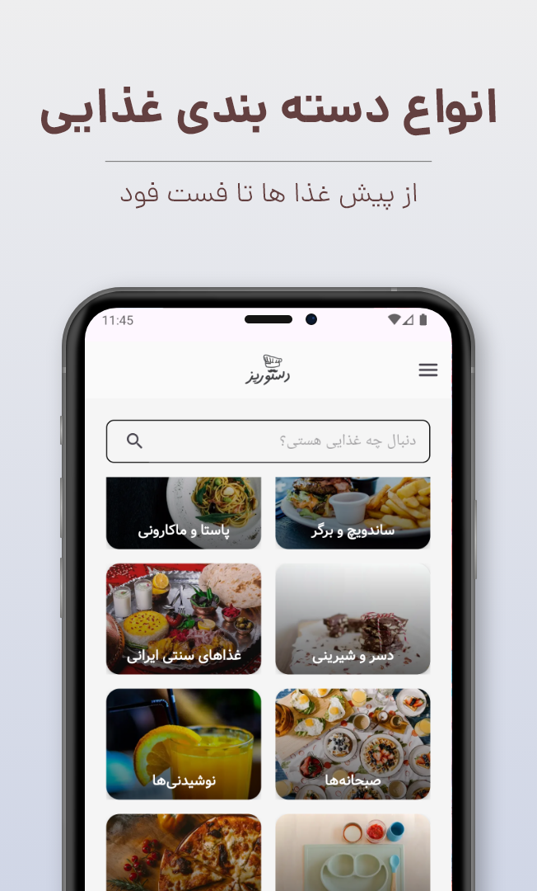

# Description

 With "DastorPaz", cooking is easier than ever!
Have hundreds of recipes for food, desserts and sweets in one comprehensive application. Always be a professional chef with various educational recipes and cooking tips! 👨‍🍳🔥

## Download 
* [cafebazaar](https://cafebazaar.ir/app/ir.shahramkhandagi.cookguide)
* [GooglePlay {Soon...}]()

## fetures :
- Recipes for all kinds of Iranian and international dishes
- Delicious and varied desserts
- Quick search and functional categories
- Amazing UI
- Simple & Clean Code
- etc...

## App Screenshots 📷

  

  

    
    
    
    
  

🍽️ Download now and learn to cook professionally!
